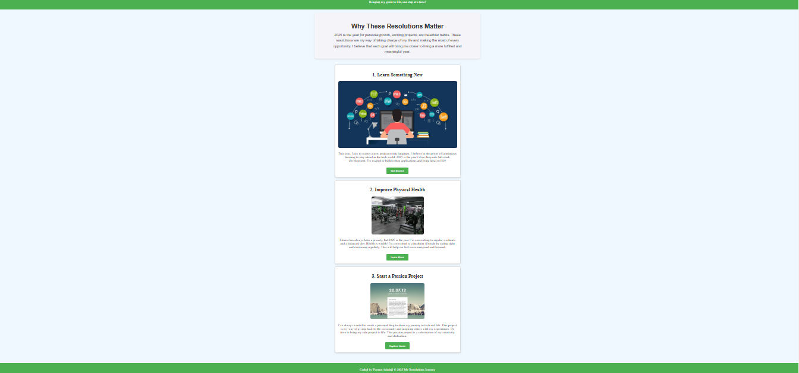

# 2025-new-years-resolutions-landing-page

## 📌 Description
The 2025 New Year's Resolutions Landing Page is a simple yet engaging webpage designed to showcase personal goals for the year. It highlights resolutions related to learning new skills, improving physical health, and starting a passion project. This landing page uses HTML, CSS, and JavaScript to create an interactive and visually appealing experience.

## 🛠 Prerequisites
N/A

## 📋 Criteria
The project meets the following criteria:
* Displays three resolutions with images and descriptions
* Provides interactive buttons with alert popups
* Uses an external CSS file for styling
* Includes a responsive layout for various screen sizes
* Features a structured and readable codebase

 ## 💻 Technologies Used
The application is built with the following technologies:
* HTML
* CSS
* JavaScript
 
## 🚀 Installation
No installation is required to use the app. It is hosted online and can be accessed via a web browser.

## 📚 Usage
1. Open the webpage in a browser.
2. Read about the 2025 resolutions.
3. Click on the buttons to get interactive alerts.
4. Explore the structure and design of the landing page.

## 🔗 Live Demo & Repository
Application can be viewed here: 
* [Live](https://ya-resolutions-landing-page.netlify.app/)

* [Repository](https://github.com/yvonnesarah/2025-new-years-resolutions-landing-page)

## 🖼 Screenshot
Below is a preview of Resolution Landing Page:

## 👥 Credit
N/A

## 📜 License
This project is open-source. For licensing details, please refer to the LICENSE file in the repository.

## 📬 Contact
You can reach me at 📧 yvonneadedeji.sarah@gmail.com.
